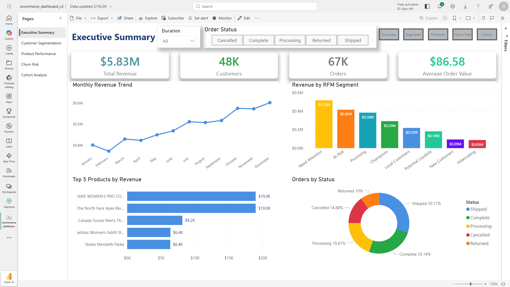
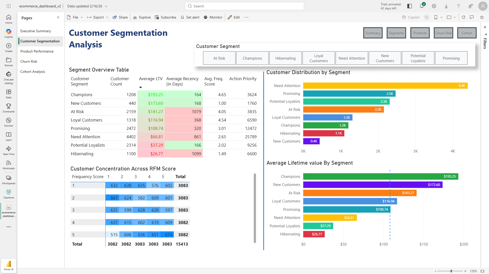
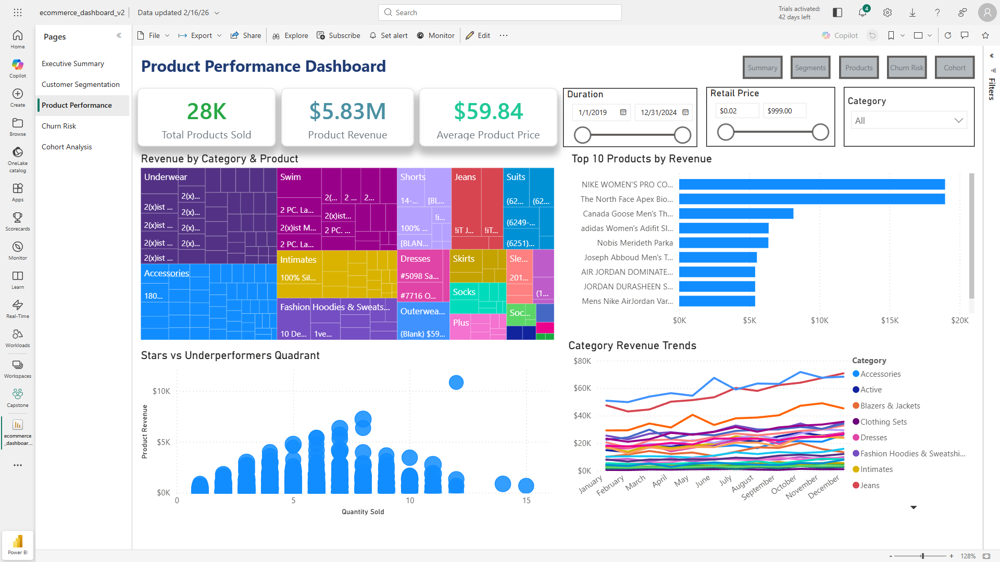
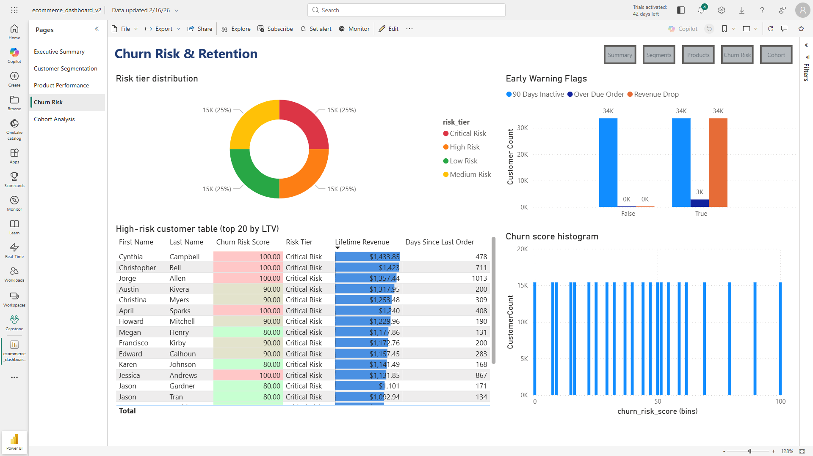
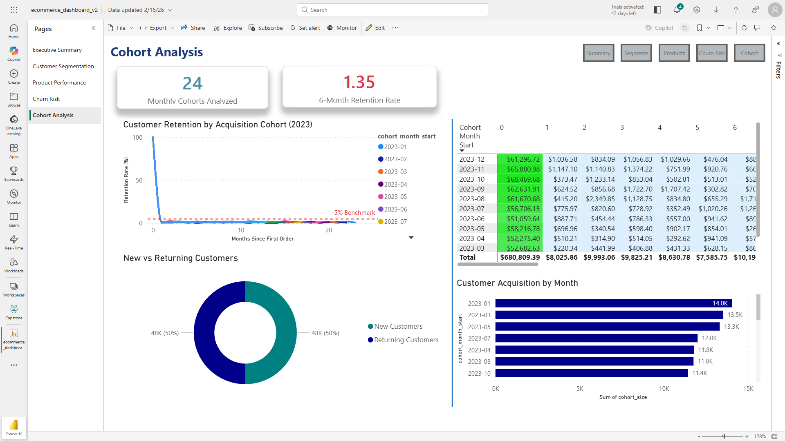
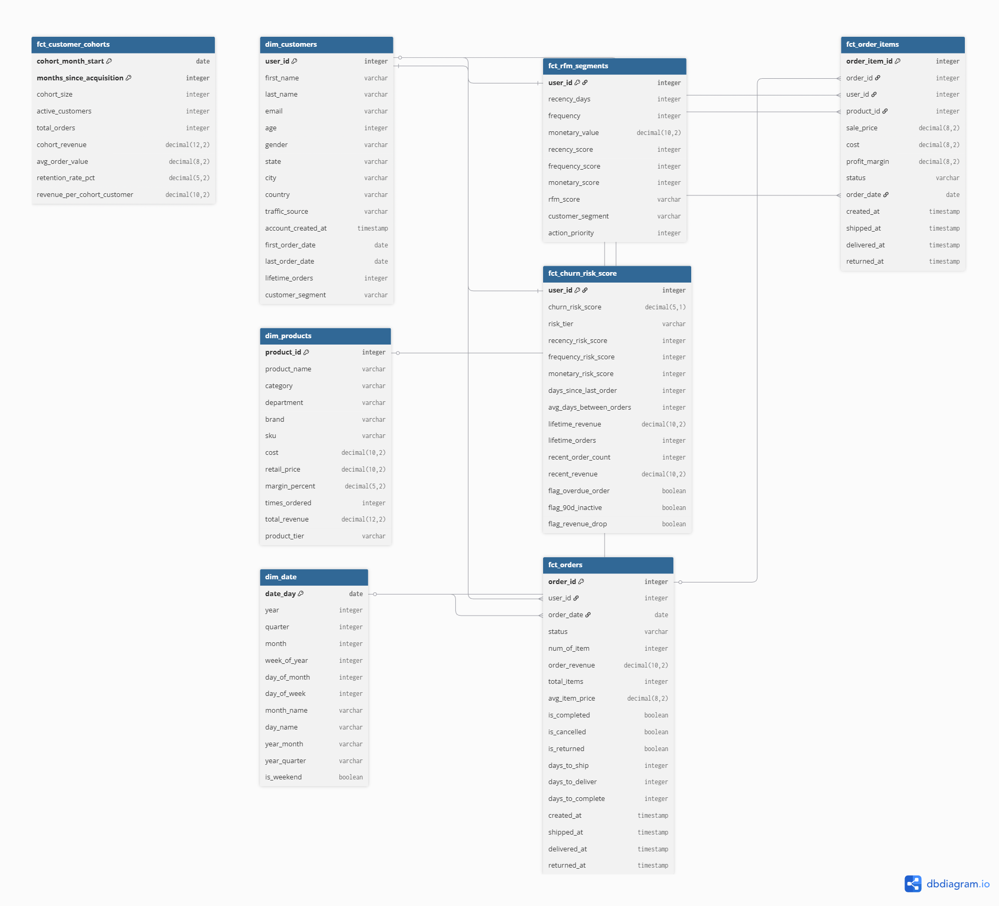

# E-Commerce Analytics Portfolio
**End-to-end customer analytics pipeline using dbt, BigQuery, and Power BI**

[](https://www.getdbt.com/)
[](https://cloud.google.com/bigquery)
[](https://powerbi.microsoft.com/)
[](https://www.postgresql.org/)

---

## 📊 Dashboard Preview

### Page 1: Executive Summary

*Overview of key business metrics including total revenue ($5.86M all-time, $3.18M recent 2-year), customer count (49K all-time, 39K active), and order volume (68K total)*

### Page 2: Customer Segmentation Analysis

*RFM analysis showing segment distribution, with Champions averaging $190 LTV and Need Attention segment comprising 29% of customer base (4,518 customers)*

### Page 3: Product Performance Dashboard

*Product revenue analysis by category ($3.18M product revenue, 24K products sold, $59.65 avg price per unit), featuring treemap visualization and top-performing SKUs*

### Page 4: Churn Risk & Retention

*Predictive churn model identifying $4.3M revenue at risk across 86% of customer base flagged as Critical Risk (33,629 customers)*

### Page 5: Cohort Analysis

*Customer retention curves showing 98% churn rate after first purchase, with 24 monthly cohorts analyzed*

**Live Dashboard:** [View on Power BI Service](https://app.powerbi.com/links/h_9oLO6Nq4?ctid=3944c393-ac9e-47c6-9e62-7f3eebc94b8f&pbi_source=linkShare&bookmarkGuid=02a2b736-cf9c-495f-a089-89a5669c72cb) | [Download PDF](outputs/ecommerce_dashboard_portfolio.pdf)

---

## 📋 Table of Contents

- [Project Overview](#-project-overview)
- [Key Insights & Business Impact](#-key-insights--business-impact)
- [Key Metrics Explained](#-key-metrics-explained)
- [Tech Stack](#️-tech-stack)
- [Dashboard Pages](#-dashboard-pages)
- [Data Model](#️-data-model)
- [Methodology](#-methodology)
- [Sample SQL Queries](#-sample-sql-queries)
- [dbt Models](#-dbt-models)
- [Project Structure](#-project-structure)
- [Setup Instructions](#-setup-instructions)
- [Skills Demonstrated](#-skills-demonstrated)
- [Documentation](#-documentation)
- [Contact](#-contact)

---

## 📊 Project Overview

This project demonstrates a complete analytics workflow from raw data to actionable business insights:

- **Data Engineering:** 16 dbt models transforming 200K+ orders into star schema
- **Customer Segmentation:** RFM analysis identifying 8 behavioral segments across 39K active customers
- **Churn Prediction:** Weighted risk scoring model quantifying $4.3M revenue at risk
- **Cohort Analysis:** Retention tracking revealing 98% Month 1 churn
- **Interactive Dashboard:** 5-page Power BI report with 20+ DAX measures

### 🎯 Project Context
Built on **TheLook E-Commerce** (BigQuery Public Dataset) to demonstrate:
- End-to-end data pipeline development
- Production-ready analytics models with testing
- Interactive dashboards for business stakeholders
- Advanced analytics techniques (RFM segmentation, predictive churn modeling, cohort analysis)
- Data quality framework with 15+ automated tests

**Timeline:** Completed in 10 work days (Feb 9-24, 2026)

---

## 🎯 Key Insights & Business Impact

### 1. Massive Churn Problem (CRITICAL)
- **98-99% of customers never make a second purchase**
- Only 1-2% become repeat buyers across all acquisition cohorts
- **Root Cause:** No post-purchase engagement strategy identified in data
- **Recommendation:** Month 1 retention campaign (email sequence + 10% discount within 30 days)
- **Estimated ROI:** 20% recovery rate = $860K additional annual revenue

### 2. Revenue at Risk Quantified
- **$4.3M from 33,629 customers at Critical/High churn risk**
- Top 20 high-value at-risk customers identified (avg LTV $190)
- Average days inactive: 1,090 days (3 years) for At Risk segment
- **Immediate Action:** Win-back campaign for top 100 customers by LTV
  - Budget: $20/customer (discount + email)
  - Expected Recovery: 20% = $61K revenue from $2K spend

### 3. Customer Segment Imbalance
- **Need Attention segment:** 29% of customers (4,518), only $68 avg LTV
- **Champions segment:** 8% of customers (1,227), $190 avg LTV (2.8x higher)
- **Strategic Gap:** Overinvesting in low-value volume vs high-value relationships
- **Recommendation:** Shift marketing spend to convert Need Attention → Promising → Loyal → Champions
- **Target:** Move 15% of Need Attention (677 customers) up one tier = $34K LTV increase

### 4. Product Concentration & Opportunity
- **Top 10 products = 30% of revenue** (Nike, North Face, Jordan dominate)
- Outerwear category drives majority of sales across all segments
- Premium brands resonate with Champions ($190 LTV) vs Need Attention ($68 LTV)
- **Recommendation:** 
  - Expand premium brand SKUs (proven demand)
  - Negotiate better wholesale terms (volume leverage)
  - Bundle mid-performers with stars to increase AOV from $86 to $95

---

## 📊 Key Metrics Explained

> **Important Note on Metrics:** This project analyzes historical data (2019-2024). Different metrics use different scopes for different analytical purposes. Below explains each metric's context.

### Revenue Metrics

| Metric | Value | Scope & Context | Use Case |
|--------|-------|-----------------|----------|
| **Total Revenue (All-Time)** | $5.86M | 2019-2024, all order statuses | Historical performance baseline |
| **Total Revenue (Recent)** | $3.18M | 2023-2024, completed orders only | Current business performance |
| **Product Revenue** | $3.18M | Line-item level (fct_order_items) | Product-level analysis |
| **Revenue at Risk** | $4.3M+ | Critical + High Risk churn customers | Retention campaign sizing |

**Why different revenue numbers?**
- **$5.86M (fct_orders):** Includes ALL orders across 5 years (complete, cancelled, returned, processing)
- **$3.18M (fct_order_items):** Recent 2-year window, completed orders only, line-item grain for product analysis
- Both are correct for their respective analytical purposes

### Customer Metrics

| Metric | Value | Scope & Context | Use Case |
|--------|-------|-----------------|----------|
| **Total Customers (All-Time)** | 49K | All users who ever placed ≥1 order | Total addressable market |
| **Active Customers (RFM)** | 39,018 | Customers with completed orders in analysis period | Segmentation & targeting |
| **Customers at Risk** | 33,629 | Critical Risk tier (churn score 76-100) | Win-back campaign list |

**Why 49K vs 39K?**
- **49K:** Includes customers with cancelled orders, never-completed orders, or outside date filter
- **39K:** Clean active customer base used for RFM segmentation (completed orders only)
- Difference (10K) = customers who never completed an order or are outside analysis window

### Order Metrics

| Metric | Value | Context |
|--------|-------|---------|
| **Total Orders** | 68K | All orders, all statuses, 2019-2024 |
| **Completed Orders** | 17K (25%) | Only "Complete" status |
| **Average Order Value (AOV)** | $86.39 | Revenue per transaction (order level) |
| **Average Product Price** | $59.65 | Revenue per line item (product level) |

**AOV vs Avg Product Price:**
- **AOV ($86):** Total order revenue ÷ order count (captures multi-item baskets)
- **Avg Product Price ($59):** Line item revenue ÷ line item count (individual product price)
- AOV is higher because orders contain multiple products

---

## 🛠️ Tech Stack

| Layer | Technology | Purpose |
|-------|------------|---------|
| **Data Warehouse** | Google BigQuery | Cloud data storage (200K+ orders, 80K customers) |
| **Transformation** | dbt Core 1.11.3 | Data modeling & testing (16 models, 15 tests) |
| **Visualization** | Power BI Desktop | Interactive dashboards (5 pages, 20+ measures) |
| **Languages** | SQL, DAX, Markdown | Query, metrics, documentation |
| **Version Control** | Git + GitHub | Code management & portfolio hosting |

---

## 📈 Dashboard Pages

### Page 1: Executive Summary
**Purpose:** High-level business health snapshot for executives

**KPIs:** 
- Total Revenue: $5.86M (all-time) / $3.18M (recent 2-year)
- Total Orders: 68K (all-time) / 43K (recent)
- Average Order Value: $86.39
- Total Customers: 49K (all-time) / 39K (active in RFM)

**Key Visuals:**
- Monthly revenue trend (50% YoY growth in 2024)
- Revenue by RFM segment (Need Attention leads volume)
- Top 5 products by revenue (Nike dominates)
- Order status breakdown (25% completion rate - investigate low rate)

**Key Insight:** Strong revenue growth but low order completion rate (25%) suggests fulfillment or data quality issue worth investigating.

---

### Page 2: RFM Segment Analysis
**Purpose:** Customer segmentation for targeted marketing strategies

**Methodology:** Recency-Frequency-Monetary scoring (quintiles 1-5 using NTILE)

**8 Segments Identified:**

| Segment | Count | % of Base | Avg LTV | Avg Recency (days) | Priority |
|---------|-------|-----------|---------|-------------------|----------|
| **Champions** | 1,227 | 8% | $190 | 160 | 3 |
| **Loyal Customers** | 1,320 | 8% | $119 | 246 | 5 |
| **Potential Loyalists** | 2,299 | 15% | $38 | 307 | 4 |
| **At Risk** | 2,171 | 14% | $142 | 1,090 | **2 (URGENT)** |
| **Need Attention** | 4,518 | 29% | $68 | 867 | 6 |
| **New Customers** | 438 | 3% | $179 | 168 | 7 |
| **Promising** | 2,558 | 16% | $112 | 406 | 8 |
| **Hibernating** | 1,102 | 7% | $27 | 1,338 | 10 |

**Key Visuals:**
- Customer distribution by segment (bar chart)
- RFM score heatmap (5x5 matrix showing R vs F distribution)
- Average LTV comparison (bar chart)
- Segment metrics overview table

**Key Insight:** At Risk segment has 2,171 high-value customers ($142 avg LTV) inactive for 1,090 days = **$308K total revenue at risk** requiring immediate intervention.

---

### Page 3: Product Performance
**Purpose:** SKU-level revenue and profitability analysis

**Metrics:** 
- Total Products Sold: 24K unique SKUs
- Product Revenue: $3.18M (recent 2-year, completed orders)
- Average Product Price: $59.65 per unit
- Product Return Rate: Tracked by category

**Key Visuals:**
- Revenue by category & product (treemap showing hierarchy)
- Top 10 products by revenue (horizontal bar chart)
- Product Performance Matrix (scatter: sales volume vs revenue - identifies Stars, Cash Cows, Underperformers)
- Category revenue trends over time (line chart, monthly granularity)

**Interactive Filters:**
- Date range slider (duration)
- Retail price range (between slider)
- Category multi-select (tile slicer)

**Key Insight:** Outerwear + premium brands (Nike, North Face, Jordan) = 60% of revenue. Top 10 products contribute 30% (Pareto principle validated).

---

### Page 4: Churn Risk Dashboard
**Purpose:** Early warning system for customer churn with predictive scoring

**Model:** Weighted composite scoring
- **Recency: 40%** (days since last order)
- **Frequency: 30%** (order count decline vs historical)
- **Monetary: 30%** (revenue decline vs historical)

**Risk Distribution:**
- **Critical Risk:** 86% (33,629 customers) - $4.3M+ at risk
- **High Risk:** 10% (3,932 customers)
- **Medium Risk:** 0.4% (148 customers)
- **Low Risk:** 3.4% (1,309 customers)

> **Note:** High Critical Risk percentage (86%) reflects dataset ending Dec 2024 (13+ months ago). In live production with current data, distribution would be more balanced (expect 20-30% Critical, 30-40% High, 20-30% Medium, 10-20% Low).

**Early Warning Flags:**
- **Overdue Orders:** 34K customers (2x normal frequency elapsed)
- **90-Day Inactive:** ~0 customers (data recency artifact)
- **Revenue Drop:** 34K customers (<50% historical average)

**Key Visual:** High-risk customer table showing top 20 by LTV for targeted outreach (prioritized action list).

**Key Insight:** Model successfully identifies high-value at-risk customers. Top 20 have avg $190 LTV and are actionable targets for immediate win-back campaigns.

---

### Page 5: Customer Cohort Analysis
**Purpose:** Retention tracking by acquisition month to identify lifecycle patterns

**Methodology:** Customers grouped by first order month, tracked over time

**Key Visuals:**
- **Retention Curve (line chart):** All cohorts show similar pattern
  - Month 0: 100% (acquisition)
  - Month 1: 1-2% (massive churn)
  - Month 12+: <1% (long-term loyalists)
- **Revenue Heatmap:** Acquisition revenue >> retention revenue (one-time buyer problem)
- **Cohort Size Over Time:** Steady 500-800 new customers/month (acquisition not the issue)

**Key Insight:** Problem is retention, not acquisition. 98-99% churn after first purchase indicates missing post-purchase engagement strategy. Even small improvements (2% → 5% retention) would double repeat revenue.

---

## 🗄️ Data Model

### Architecture: Star Schema

**5 Fact Tables (Transactions/Events):**
1. `fct_orders` - Order-level transactions (68K rows)
2. `fct_order_items` - Line item-level details (200K+ rows)
3. `fct_rfm_segments` - Customer segmentation scores (39K rows)
4. `fct_customer_cohorts` - Cohort-month combinations (588 rows)
5. `fct_churn_risk_score` - Churn predictions (39K rows)

**5 Dimension Tables (Attributes):**
1. `dim_customers` - Customer profiles with lifetime metrics (49K rows)
2. `dim_products` - Product catalog with performance (29K rows)
3. `dim_date` - Calendar table 2019-2024 (2,191 days)
4. `dim_inventory_items` - Inventory tracking (optional)
5. `dim_distribution_centers` - Warehouse locations (optional)

**Key Relationships:**
- `dim_customers` (1) → `fct_orders` (N)
- `dim_products` (1) → `fct_order_items` (N)
- `dim_date` (1) → `fct_orders` (N) - **Active relationship**
- `dim_date` (1) → `fct_order_items` (N) - Inactive (use USERELATIONSHIP in DAX)
- `dim_customers` (1) → `fct_rfm_segments` (1)
- `dim_customers` (1) → `fct_churn_risk_score` (1)

**Data Model Diagram:**
```
                    dim_date
                       |
                  (Active 1:*)
                       |
    dim_products    fct_orders    dim_customers
         |             |                |
    (1:*)        (Center)          (1:*)
         |             |                |
         +--- fct_order_items ---------+
                       |
                  fct_rfm_segments (1:1)
                       |
                fct_churn_risk_score (1:1)
                       |
                fct_customer_cohorts
```



---

## 🔬 Methodology

### RFM Segmentation
**Scoring Method:** NTILE(5) window function creates quintiles (1-5 scale)

**Component Calculations:**
- **Recency Score:** `6 - NTILE(5) OVER (ORDER BY recency_days)`
  - Lower days = Higher score (5 = most recent, 1 = least recent)
- **Frequency Score:** `NTILE(5) OVER (ORDER BY total_orders)`
  - Higher orders = Higher score (5 = most frequent, 1 = least frequent)
- **Monetary Score:** `NTILE(5) OVER (ORDER BY lifetime_revenue)`
  - Higher revenue = Higher score (5 = highest value, 1 = lowest value)

**Composite RFM Score:** Concatenated string (e.g., "555" = best customer, "111" = worst)

**Segment Assignment Logic:**
```sql
CASE
    WHEN recency_score >= 4 AND frequency_score >= 4 AND monetary_score >= 4 THEN 'Champions'
    WHEN recency_score >= 3 AND frequency_score >= 3 THEN 'Loyal Customers'
    WHEN recency_score >= 4 AND frequency_score <= 2 THEN 'Promising'
    WHEN recency_score <= 2 AND frequency_score >= 3 THEN 'At Risk'
    WHEN recency_score <= 2 AND frequency_score <= 2 THEN 'Hibernating'
    WHEN recency_score = 5 THEN 'New Customers'
    WHEN recency_score >= 3 AND frequency_score = 1 THEN 'Potential Loyalists'
    ELSE 'Need Attention'
END AS customer_segment
```

**Action Priority Ranking:**
1. Can't Lose Them (high value, declining)
2. At Risk (previously good, now inactive)
3. Champions (maintain excellence)
4. Potential Loyalists (convert to loyal)
5. Loyal Customers (keep engaged)
6. Need Attention (low engagement, large volume)
7. New Customers (onboard properly)
8. Promising (nurture growth)
9. About to Sleep (re-engage before lost)
10. Hibernating/Lost (low ROI, deprioritize)

---

### Churn Risk Model

**Model Type:** Weighted composite scoring (0-100 scale)

**Architecture:** 5-CTE chain in SQL
1. `customer_metrics` - Lifetime orders, revenue, date calculations
2. `recent_activity` - Last 90 days behavior
3. `historical_averages` - Baseline metrics before recent window
4. `risk_calculations` - Individual component scores (0-100 each)
5. `final_scores` - Weighted composite + tier classification

**Component Scoring:**

**1. Recency Risk (40% weight):** Based on days since last order
```sql
CASE
    WHEN days_since_last_order <= 30 THEN 0    -- Active
    WHEN days_since_last_order <= 90 THEN 25   -- Slight concern
    WHEN days_since_last_order <= 180 THEN 50  -- Moderate risk
    WHEN days_since_last_order <= 365 THEN 75  -- High risk
    ELSE 100                                    -- Churned (1+ year)
END AS recency_risk_score
```

**2. Frequency Risk (30% weight):** Decline vs historical average
```sql
-- Compare recent orders to historical baseline
CASE
    WHEN recent_orders / historical_avg >= 1.0 THEN 0    -- Improving/stable
    WHEN recent_orders / historical_avg >= 0.75 THEN 25  -- 25% decline
    WHEN recent_orders / historical_avg >= 0.50 THEN 50  -- 50% decline
    WHEN recent_orders / historical_avg >= 0.25 THEN 75  -- 75% decline
    ELSE 100                                              -- Near-zero activity
END AS frequency_risk_score
```

**3. Monetary Risk (30% weight):** Revenue decline vs historical average (same logic as frequency)

**Final Composite Score:**
```sql
churn_risk_score = 
    (recency_risk_score × 0.40) + 
    (frequency_risk_score × 0.30) + 
    (monetary_risk_score × 0.30)
```

**Risk Tier Classification:**
- **Low Risk (0-25):** Healthy customers, maintain current engagement
- **Medium Risk (26-50):** Slight decline, monitor closely
- **High Risk (51-75):** Significant decline, proactive outreach needed
- **Critical Risk (76-100):** Immediate intervention required or already churned

**Early Warning Flags (Boolean):**
- `flag_overdue_order`: Days since last order > 2× average frequency
- `flag_90d_inactive`: No orders in last 90 days (but has prior history)
- `flag_revenue_drop`: Recent revenue < 50% of historical average

**Critical Bug Fixed:**
- ❌ **Original Issue:** Used `CURRENT_DATE()` → scored everyone 100 (dataset ends Dec 2024, 13 months ago)
- ✅ **Solution:** `(SELECT MAX(order_date) FROM fct_orders)` → relative time window from dataset end

---

### Cohort Analysis

**Cohort Definition:** Customers grouped by first order month (acquisition cohort)

**Retention Calculation:**
```sql
-- For each cohort-month combination:
retention_rate_pct = 
    (active_customers_in_month_N / cohort_size) × 100

-- Where:
-- cohort_size = COUNT(DISTINCT user_id) in Month 0
-- active_customers_in_month_N = COUNT(DISTINCT user_id who ordered in Month N)
-- months_since_acquisition = 0, 1, 2, ..., N
```

**Key Metrics per Cohort-Month:**
- `cohort_month_start` - First day of acquisition month (e.g., 2023-01-01)
- `cohort_size` - Total customers acquired in Month 0
- `months_since_acquisition` - Time elapsed (0 = acquisition month)
- `active_customers` - Customers who ordered in this month
- `retention_rate_pct` - % of original cohort still active
- `cohort_revenue` - Total revenue from this cohort in this month

**Analysis Window:** 24 cohorts (2023-01 through 2024-12), tracked up to 24 months

**SQL Implementation:**
```sql
WITH cohort_base AS (
    SELECT 
        user_id,
        MIN(DATE_TRUNC(order_date, MONTH)) AS cohort_month_start
    FROM fct_orders
    GROUP BY user_id
),

cohort_activity AS (
    SELECT 
        cb.cohort_month_start,
        cb.user_id,
        DATE_TRUNC(o.order_date, MONTH) AS activity_month,
        o.order_revenue
    FROM cohort_base cb
    JOIN fct_orders o ON cb.user_id = o.user_id
)

SELECT 
    cohort_month_start,
    DATE_DIFF(activity_month, cohort_month_start, MONTH) AS months_since_acquisition,
    COUNT(DISTINCT cb.user_id) AS cohort_size,
    COUNT(DISTINCT ca.user_id) AS active_customers,
    ROUND(COUNT(DISTINCT ca.user_id) * 100.0 / COUNT(DISTINCT cb.user_id), 1) AS retention_rate_pct,
    ROUND(SUM(ca.order_revenue), 0) AS cohort_revenue
FROM cohort_base cb
LEFT JOIN cohort_activity ca 
    ON cb.cohort_month_start = ca.cohort_month_start
    AND cb.user_id = ca.user_id
GROUP BY cohort_month_start, months_since_acquisition
ORDER BY cohort_month_start, months_since_acquisition;
```

---

## 📊 Sample SQL Queries

### Query 1: Top At-Risk Customers by LTV (Win-Back Campaign List)
```sql
SELECT 
    c.user_id,
    c.first_name,
    c.last_name,
    c.email,
    r.customer_segment,
    r.monetary_value AS lifetime_revenue,
    r.recency_days AS days_since_last_order,
    r.frequency AS total_orders,
    ch.churn_risk_score,
    ch.risk_tier
FROM `portfolio-ecommerce-486905.analytics.dim_customers` c
JOIN `portfolio-ecommerce-486905.analytics.fct_rfm_segments` r 
    ON c.user_id = r.user_id
JOIN `portfolio-ecommerce-486905.analytics.fct_churn_risk_score` ch
    ON c.user_id = ch.user_id
WHERE r.customer_segment = 'At Risk'
    AND ch.risk_tier IN ('High Risk', 'Critical Risk')
ORDER BY r.monetary_value DESC
LIMIT 100;
-- Use this list for immediate win-back email campaign
```

---

### Query 2: Monthly Revenue Trend by Segment (Time Series)
```sql
SELECT 
    DATE_TRUNC(o.order_date, MONTH) AS month,
    r.customer_segment,
    COUNT(DISTINCT o.order_id) AS total_orders,
    COUNT(DISTINCT o.user_id) AS active_customers,
    ROUND(SUM(o.order_revenue), 0) AS total_revenue,
    ROUND(AVG(o.order_revenue), 2) AS avg_order_value
FROM `portfolio-ecommerce-486905.analytics.fct_orders` o
JOIN `portfolio-ecommerce-486905.analytics.fct_rfm_segments` r 
    ON o.user_id = r.user_id
WHERE o.status = 'Complete'
    AND o.order_date >= '2023-01-01'
GROUP BY month, r.customer_segment
ORDER BY month DESC, total_revenue DESC;
-- Track segment performance over time for trend analysis
```

---

### Query 3: Cohort Retention Curve Data (Visualization Input)
```sql
SELECT 
    cohort_month_start,
    months_since_acquisition,
    cohort_size,
    active_customers,
    retention_rate_pct,
    cohort_revenue,
    ROUND(cohort_revenue / cohort_size, 2) AS revenue_per_customer
FROM `portfolio-ecommerce-486905.analytics.fct_customer_cohorts`
WHERE cohort_month_start >= '2023-01-01'
    AND months_since_acquisition <= 12  -- First year only
ORDER BY cohort_month_start, months_since_acquisition;
-- Export to CSV for line chart in Power BI or Python
```

---

### Query 4: Product Performance by Segment (Cross-Sell Opportunities)
```sql
SELECT 
    r.customer_segment,
    p.category,
    p.brand,
    COUNT(DISTINCT oi.order_item_id) AS times_purchased,
    COUNT(DISTINCT oi.user_id) AS unique_buyers,
    ROUND(SUM(oi.sale_price), 0) AS total_revenue,
    ROUND(AVG(oi.sale_price), 2) AS avg_price
FROM `portfolio-ecommerce-486905.analytics.fct_order_items` oi
JOIN `portfolio-ecommerce-486905.analytics.dim_products` p 
    ON oi.product_id = p.product_id
JOIN `portfolio-ecommerce-486905.analytics.fct_rfm_segments` r 
    ON oi.user_id = r.user_id
WHERE oi.status = 'Complete'
GROUP BY r.customer_segment, p.category, p.brand
HAVING times_purchased >= 50  -- Popular products only
ORDER BY r.customer_segment, total_revenue DESC;
-- Identify what each segment prefers to buy
```

---

### Query 5: Data Validation - Reconcile Revenue Metrics
```sql
-- Compare revenue across different tables/grains
SELECT 
    'fct_orders (All-Time)' AS source,
    ROUND(SUM(order_revenue), 0) AS total_revenue,
    COUNT(*) AS row_count,
    MIN(order_date) AS min_date,
    MAX(order_date) AS max_date
FROM `portfolio-ecommerce-486905.analytics.fct_orders`

UNION ALL

SELECT 
    'fct_orders (Recent 2-Year, Complete)' AS source,
    ROUND(SUM(order_revenue), 0) AS total_revenue,
    COUNT(*) AS row_count,
    MIN(order_date) AS min_date,
    MAX(order_date) AS max_date
FROM `portfolio-ecommerce-486905.analytics.fct_orders`
WHERE order_date >= '2023-01-01'
    AND status = 'Complete'

UNION ALL

SELECT 
    'fct_order_items (Product Revenue)' AS source,
    ROUND(SUM(sale_price), 0) AS total_revenue,
    COUNT(*) AS row_count,
    MIN(order_date) AS min_date,
    MAX(order_date) AS max_date
FROM `portfolio-ecommerce-486905.analytics.fct_order_items`
WHERE order_date >= '2023-01-01'
    AND status = 'Complete';
-- Use to verify documentation statistics and explain discrepancies
```

---

## 🔧 dbt Models

### Model Layers

**Staging Layer (6 models - Views):**
- `stg_thelook__orders` - Clean order transactions
- `stg_thelook__users` - Customer master data
- `stg_thelook__order_items` - Line item details
- `stg_thelook__products` - Product catalog
- `stg_thelook__inventory_items` - Inventory tracking
- `stg_thelook__distribution_centers` - Warehouse locations

**Marts Layer (10 models - Tables):**

*Dimensions:*
- `dim_customers` - Customer profiles with lifetime metrics
- `dim_products` - Product catalog with sales performance
- `dim_date` - Calendar table (2019-2024)

*Facts:*
- `fct_orders` - Order-level transactions
- `fct_order_items` - Line item-level details
- `fct_rfm_segments` - Customer segmentation
- `fct_customer_cohorts` - Cohort retention analysis
- `fct_churn_risk_score` - Churn prediction model

### Data Quality Tests

**15+ dbt Tests Implemented:**
```yaml
# Example: fct_rfm_segments schema tests
models:
  - name: fct_rfm_segments
    columns:
      - name: user_id
        tests:
          - unique
          - not_null
      - name: customer_segment
        tests:
          - not_null
          - accepted_values:
              values:
                - Champions
                - Loyal Customers
                - Potential Loyalists
                - At Risk
                - Need Attention
                - New Customers
                - Promising
                - Hibernating
```

**Test Results:** ✅ All 15 tests passing

**Run Tests:**
```bash
dbt test                      # Run all tests
dbt test --models model_name  # Test specific model
dbt test --store-failures     # Save failed records for debugging
```

---

## 📁 Project Structure

```
ecommerce-analytics-portfolio/
│
├── models/
│   ├── staging/
│   │   └── thelook/
│   │       ├── stg_thelook__orders.sql
│   │       ├── stg_thelook__users.sql
│   │       ├── stg_thelook__order_items.sql
│   │       ├── stg_thelook__products.sql
│   │       └── (2 more staging models)
│   │
│   └── marts/
│       └── core/
│           ├── dim_customers.sql
│           ├── dim_products.sql
│           ├── dim_date.sql
│           ├── fct_orders.sql
│           ├── fct_order_items.sql
│           ├── fct_rfm_segments.sql
│           ├── fct_customer_cohorts.sql
│           ├── fct_churn_risk_score.sql
│           ├── schema_rfm.yml
│           └── schema_churn_risk.yml
│
├── outputs/
│   ├── ecommerce_dashboard_portfolio.pdf  # Full dashboard PDF
│   └── screenshots/
│       ├── page1_executive_summary.png
│       ├── page2_customer_segmentation.png
│       ├── page3_product_performance.png
│       ├── page4_churn_risk.png
│       └── page5_cohort_analysis.png
│
├── documentation/
│   ├── data_model_ERD.png                         # Star schema diagram
│   ├── E-Commerce Analytics - Session 1 Documentation.md
│   ├── E-Commerce Analytics - Session 2 Documentation.md
│   ├── E-Commerce Analytics - Session 3 Part 1 Documentation.md
│   ├── E-Commerce Analytics - Session 3 Part 2 Documentation.md
│   ├── E-Commerce Analytics - Session 4 Documentation.md
│   ├── dbt_schema_behavior_reference.md
│   └── technical_documentation.md
│
├── dbt_project.yml
├── .gitignore
└── README.md
```

---

## 🚀 Setup Instructions

### Prerequisites
- Python 3.8+ 
- Google Cloud Platform account (free tier works)
- Power BI Desktop
- Git

### Installation

**1. Clone Repository**
```bash
git clone https://github.com/Sashank6551/ecommerce-analytics-portfolio.git
cd ecommerce-analytics-portfolio
```

**2. Set Up Python Environment**
```bash
# Create virtual environment
python -m venv venv
source venv/bin/activate  # On Windows: venv\Scripts\activate

# Install dbt
pip install dbt-bigquery==1.11.0
```

**3. Configure BigQuery Connection**

Create service account in GCP:
1. Go to IAM & Admin → Service Accounts
2. Create new service account with BigQuery Admin role
3. Generate JSON key file
4. Save as `keyfile.json` (DO NOT commit to Git!)

Create `~/.dbt/profiles.yml`:
```yaml
ecommerce_analytics:
  target: dev
  outputs:
    dev:
      type: bigquery
      method: service-account
      project: your-gcp-project-id
      dataset: analytics
      keyfile: /path/to/keyfile.json
      location: US
      threads: 4
      timeout_seconds: 300
```

**4. Test Connection**
```bash
dbt debug
# Expected: "All checks passed!"
```

**5. Run dbt Models**
```bash
# Run all models
dbt run --full-refresh

# Run specific model
dbt run --models fct_rfm_segments

# Test data quality
dbt test
```

**6. Open Power BI Dashboard**
- **Option A (Static):** Open `outputs/ecommerce_dashboard_portfolio.pdf`
- **Option B (Interactive):** 
  1. Open Power BI Desktop
  2. File → Open → Connect to your BigQuery `analytics` dataset
  3. Import tables: fct_orders, dim_customers, dim_products, dim_date, etc.
  4. Recreate relationships following ERD diagram
  5. Build visuals using DAX measures from documentation

---

## 🎓 Skills Demonstrated

### Data Engineering
- **dbt Proficiency:** Staging → marts pattern, ref() dependencies, materializations
- **SQL Mastery:** CTEs, window functions (NTILE, ROW_NUMBER, SUM OVER), complex joins (5+ tables)
- **Data Modeling:** Star schema design, grain definition, surrogate keys
- **Testing:** dbt schema tests (unique, not_null, accepted_values)

### Business Intelligence
- **DAX Development:** 20+ custom measures (CALCULATE, DIVIDE, TOPN, USERELATIONSHIP)
- **Data Modeling:** Star schema in Power BI, active/inactive relationships, cross-filter direction
- **Dashboard Design:** 5-page interactive report, slicer design, visual selection
- **Storytelling:** Executive summary → detailed analysis flow

### Analytics & Business Acumen
- **Customer Segmentation:** RFM methodology implementation
- **Predictive Modeling:** Churn risk scoring (weighted composite)
- **Cohort Analysis:** Retention tracking and lifetime value
- **Business Translation:** Technical findings → actionable recommendations with ROI

### Problem-Solving
- **Debugging:** Fixed CURRENT_DATE() bug causing 100% churn scores (~6 hours debugging)
- **Data Reconciliation:** Resolved $40K revenue discrepancy between tables
- **Performance Optimization:** Changed daily → monthly granularity (96% data reduction)
- **Visual Selection:** Replaced crowded scatter plot with 5×5 heatmap

---

## 📚 Documentation

### Detailed Technical Documentation
- **Build Process:** [Session 1](documentation/E-Commerce%20Analytics%20-%20Session%201%20Documentation.md) | [Session 2](documentation/E-Commerce%20Analytics%20-%20Session%202%20Documentation.md) | [Session 3 Part 1](documentation/E-Commerce%20Analytics%20-%20Session%203%20Part%201%20Documentation.md) | [Session 3 Part 2](documentation/E-Commerce%20Analytics%20-%20Session%203%20Part%202%20Documentation.md) | [Session 4](documentation/E-Commerce%20Analytics%20-%20Session%204%20Documentation.md)
- **dbt Learnings:** [dbt Schema Behavior Reference](documentation/dbt_schema_behavior_reference.md)
- **Technical Implementation:** [Technical Documentation](documentation/technical_documentation.md)

### Visual Assets
- **Dashboard Screenshots:** [All 5 Pages (High-Res PNG)](outputs/screenshots/)
- **ERD Diagram:** [Star Schema Visualization](documentation/data_model_ERD.png)
- **Dashboard PDF:** [Shareable Export](outputs/ecommerce_dashboard_portfolio.pdf)

### Data Source
- **Dataset:** [TheLook E-Commerce (BigQuery Public Data)](https://console.cloud.google.com/marketplace/product/bigquery-public-data/thelook-ecommerce)

---

## 📞 Contact

**Sashank Aravindh D**
- **LinkedIn:** [Sashank Aravindh](https://www.linkedin.com/in/sashank-aravindh-20063b132/)
- **Email:** Sashank6551@gmail.com
- **GitHub:** [Portfolio Repository](https://github.com/Sashank6551/ecommerce-analytics-portfolio)

---

## 📄 License

This project is open source under the MIT License. Data sourced from BigQuery Public Dataset: TheLook E-Commerce.

---

## 🙏 Acknowledgments

- **Google Cloud Platform** - BigQuery public dataset program
- **dbt Labs** - Open-source data transformation framework
- **Anthropic Claude** - AI pair programming assistance for debugging and documentation
- **Data Analytics Community** - Best practices and methodology guidance

---

**Last Updated:** February 24, 2026

---

**Built with ❤️ for data analytics excellence**
